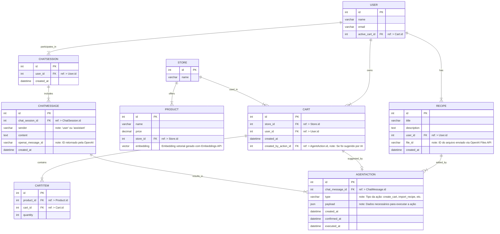

# 🛒 App de Supermercado com Integração de IA

Este módulo apresenta um estudo de caso prático de uso de APIs da OpenAI em um app de supermercado com marketplace. Nele iremos aplicar a integração **agent + embeddings + file upload** para organizar compras com base em **receitas**.

---

## 🎯 Objetivo

Permitir que o usuário:

- Busque produtos previamente cadastrados por diferentes lojas
- Crie carrinhos de compras manualmente
- Interaja com um agente de IA que:
  - Conhece receitas populares
  - Recebe receitas do usuário em formato de PDF
  - Monte carrinhos de compras com base em receitas
  - Mostra a comparação de carrinhos por loja, ranqueando-os com base nos produtos disponíveis e preços

---

## 🧠 Tecnologias e APIs de IA utilizadas

- **Nest JS** – para construção da API
- **Next JS** – para construção do front-end
- **PostgreSQL** – para persistência de dados
  - **PGVector** – para indexação e busca de embeddings
- **OpenAI API** – para integração com o modelo de linguagem
  - **OpenAI Embeddings API** – para vetorização de receitas e produtos
  - **OpenAI File Upload + Responses API** – para permitir leitura contextual de arquivos de receitas
  - **Cosine Similarity Local** – para validar produtos similares na montagem do carrinho

## Diagrama ER

